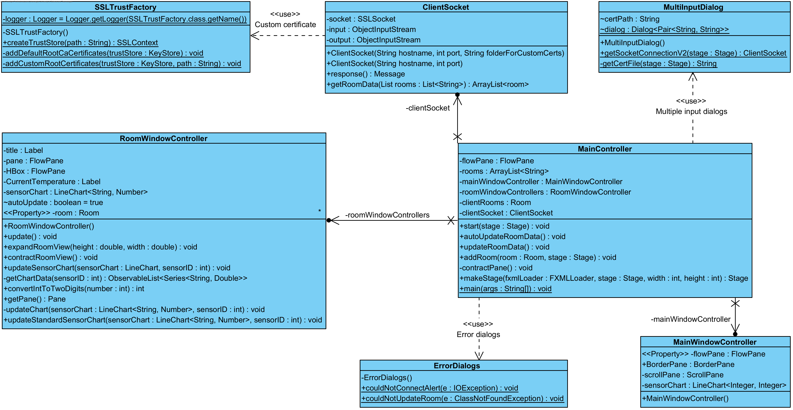

# IDATA2304 Temperature Logger

This is a school project in the course IDATA2304 Computer Networks for the students within the computer engineering course 2022 on NTNU.
The project is part of our evaluation within the course with a 40% weight on out grades.  

## Abstract

Temperature is something that effects us every day.

--------------------------------------------------------------------------------
This is the shortest version of your project's description. Think of a busy
person who has 1 minute to get familiar with what this is about. The abstract
should be short but descriptive.
Suggested content in the abstract:

* Describe the background and importance of the situation, 1-2 sentences
* Describe a problem, 1-2 sentences
* Describe your proposed solution, 1-3 sentences
* Describe the results you have achieved, 1-3 sentences
* Describe the experiments or evaluation you have done
* Conclusions and possible future work

Here is an example abstract of an imaginary project:
Modern urban lifestyle has high demands on the individuals. We have busy
schedules and need to remember many things. One of the most irritating things in
a hectic morning is the inability to find your keys or wallet. In this
project we propose a novel solution for tracking of daily-life objects, such as
your wallet or keychain. Users attach smart chips with Bluetooth communication
to each important asset they want to track. This gives the ability to use a
smartphone to locate the missing item. We have created a prototype system,
described in this report. We have performed a user study with 20 participants
who were given the task to locate a wallet inside a living room.
The results show that our solution helps the users to locate their items within
2 minutes the first time, and within 45 seconds when they are using the app
repeatedly. Possible future research directions include design of a robust and
lightweight RFID tag, and possibilities to locate ones items using a mobile
phone of a family member.

Note: in your project you may not have user tests. Describe the analysis and
evaluation you have had.

--------------------------------------------------------------------------------

In modern society sleeping problems is a common problem. Sleep problems might
have many causes, but two of the most common causes is the room
temperature and humidity. To avoid this problem, we have made a temperature
logger that measures the temperature in a room and sends the data to a database.
The data is then visualized in an application. This way the user can see what
temperature makes for the best sleep quality, and if the humidity is on the
best levels for good sleep and good health. Possible future work could be
adding the ability to see the average temperature and humidity at any time of day,
and the ability to rate your sleep to see better what makes the sleep quality
increase, and what makes it decrease.

## Introduction

Here you introduce your project in more detail. Include the following:

* Introduction of the context, the domain. Where will your solution work? Is
  this the maritime domain, finance, private homes?
* Introduction of the problem. What is problematic in this environment? What
  will you solve? Why is this relevant?
* Short introduction in the rest of the report, preferably with links to the
  other chapters. For example, "We propose an Internet-of-Things system using
  temperature and humidity sensors. First we describe the used
  protocols, ["theory and technology"]. Then we describe our work process
  in ["Methodology"]. Then the obtained [results] are presented, followed by
  [reflection and discussion of possible improvements]." Note: don't copy this
  text, write your own!

In a world where more and more people struggle with sleep problems, it's
important to do research and make products that can help people
fixing these problems to increase their quality of life. As a part of
the solution, our temperature sensor, is designed to be placed in the
bedroom of a user, tracking the temperature and humidity of the room.
Methodology contains the method we used to get to the result, how we
worked in groups, how distributed the, tasks, how we got passed obstacles
and how we evaluated the result.

In this report there will be a focus on the device and how it was created. The chapter theory and technology, will
define important terms used in the report and the specific technology in use in our product.

We have made an application that measures and records the temperature and humidity
in a room throughout the day via a temperature- and humidity-sensor.
There are many benefits to monitoring your indoor environmental conditions with an application such as this.
One of the most important reasons to use a sensor like this,
is to make sure that you are maintaining a healthy indoor air quality in the various rooms in your house,
such as your living room, bedroom, and bathroom.
Because if you don’t, you may risk affecting your, and others’, health.

As previously stated, poor indoor air quality can bring some unfortunate consequences.
Mould in the house can cause sickness like a stuffy nose, sore throat,
coughing, burning eyes and rashes on your skin.
If you are allergic to mould, depending on the severity of the allergy,
can lead to very serious reactions, and hospital visits.
It has also been documented that the proper temperature and humidity has direct impact on the quality of your sleep.

If you have been having trouble getting a good night’s sleep,
it might be worth taking into consideration the temperature and humidity in your bedroom during the night.
Depending on where your bedroom windows are located, and the climate your country experiences,
you might be having some humidity and temperature swings during the night that can negatively influence your sleep.
Research shows that the ideal temperature for a bedroom is around 14-18 degrees Celsius.
The proper humidity in a bedroom fluctuates depending on the season,
but should be around 50% in the winter and a little higher in the summer, but not above 60%.
Using our temperature and humidity sensor could assist greatly in making sure your sleep conditions are optimal,
so that you wake up rested and can live a healthy and happy life.

# Above this needs to have references

These are just a few examples of the importance of our project
and what problems in our every-day lives it can help to solve.

## Theory and technology

Since we build our own server and the client were also written in java we decided to use the ObjectInput and ObjectOutput streams, so we could send objects back and forth. This was so the implementation of both sides could be easier done, and since it already was created it saved us for some work.

The message object that we are sending was highly inspired by the HTTP standard. There was 1 major benefits for doing it this way. It would allow for a good and fast implementation of allowing the HTTP protocols.

The project is highly reliant of the TCP protocol because we needed the reliability for the packages not becoming lost or corrupted. UDP was not a alternative since we were not "sending enough packages often enough". The only case within the project were that would be "good enough" was if you had enough sensors in a room to where inaccurate data would not be a problem anymore. We also wanted to implement the use of HTTP also within the project. This would allow for clients or code not running native java, like a arduino, to communicate with the server using JSON objects. Since both standards are well known, it would also be both easier for other developers to create sensors by giving them some requirements of what they had to send.

The encryption method we decided on was the use of TLS. This was with the anticipation of allowing for web browsers to take contact with the server by using the HTTP protocol. While the solution in Java was "tricky" to implement it (Java does not have a "easy" solution for this) was worth it in the end. We decided against letting the java client trust everything and instead add functionality to fetch different self-signed certificate from a folder. This allows us to take the full functionality of TLS to verify the source was trustworthy while also encrypting the content and ensuring it is not tampered with.

THe only other subject we ended up implementing was IDATA2303, Data modeling and database application. This was to store the sensors, rooms and the log data. We take in the use of the database by using "connectors" to read and write data on the database file whenever the server gets a request.

## Methodology

We have focused on working individually by splitting the different parts of the projects. We had mostly two people working on the client side and one working on the server side. Meeting up often has allowed us for opening discussions or asking questions between the different group members. This has allowed us to keep up to date on what the other group members are doing and give either insight, advice or ask about implementation of their code.

We as a group did not have a "standard" way of doing things. This is because of different visions, insight and experiences between the different group members. While some created branches to label their code task others pushed straight to main with belief that the commit messages was a good enough description. This has both caused negative effects, like unfinished code would be pushed to main causing errors to show up in others code and positive effects, like getting out code faster and in some cases more reliable because of the coder being caution that the code actually works.

We have next to none "user test" since the program was very late finished within the project period. Some other types of tests we conducted was with the use of JUnit on some classes where we found it necessary to ensure that the code stilled worked after modification. This could have been done more often as there were multiple times when we had the need to modify finished code and it either reported wrong or failed after testing when communicating with clients or sensor nodes over the internet.

## Results

While we hade big ambition, we only managed to create a minimal viable product. The product is able to allow for temperature/humidity sensors to send data as long as it is registered in the database and allow for the clients to view the different rooms and sensors. We allowed for the traffic to be sent with TLS to validate and encrypt the packages.

### Server

The current working Java server uses the following implementation:

When the server receives a request trough the JavaListener it creates a new JavaClient and adds it to the ClientHandler. The JavaListener is a extension of the TCPListener that will add the client to the ClientHandler. The reason for using different specific classes to the communication is to allow for a faster and cleaner implementation of other protocols. Theoretically everything that needs to be done to implement another service to just create another listener based on the TCPListener an another Client class form ClientRunnable.

Every time the ClientRunnable finds a response, it uses the RequestHandler to process and create the proper response message. The requestHandler's job is to process the message object received from the getRequest method in the ClientRunnable. It starts by filtering the message object into the different kinds of available message types and further calls methods responsible for those kinds. It will in the end call the SQLCommandFactory that will create the right SQL statement and convert it to a java object trough the SQLConverter. If any of the methods that the requestsHandler is calling throws a error it will be logged within the respected class and the requestsHandler will use the error to create a errorMessage that the ClientRunnable will need to send.

The reason for creating the clientHandler and DBConnector pool is to allow for small optimization. The DBConnector is to already have a bunch of connectors available instead of designating one DBConnector per client. This removes the opening and closing connection on the databases whenever a client connects or disconnects. This also creates a better environment for the connector since a model where every client has it's own will work, but the connector may not be in use and only use space within the ram. The same within the clientHandler. Instead of designating a thread per client, that would be faster, it's not necessary. Since the probability of every client sending requests at the same time is very low, we could instead just check it one per time we go trough the list. This reduces the amount of thread necessarily from x clients to (1+pool size) times (1 + Clients/LimitOnClientHandler) rounded down. This makes the the amount of threads the server needs scale much better.

### Clients

The current working Java client uses the following implementation:

The application for clients is a JavaFX application. The application is split into three parts. The first part is the conection screen. The connection screen is used to connect to the server. The second part the send and recive screen. The send and recive screen is used to send and recive data from and to the server. The third is the main screen. The main screen is used to view the different rooms and sensors. The main screen also allows for the user to add new rooms and sensors.

The client application uses the ClientSo

### Sensors

Here you describe the results you have obtained. Some considerations:

* Have a top-down approach. Start with a short introduction, then go more into
  details. For example, a good way to start the section could be with a picture
  showing the overall architecture of the solution and a short text describing
  it. After that you can go into more details on each component of the system.
* Describe the structure you got, the general principles of how it works.
* You could also include some screenshots showing the system. How could the
  reader get an impression of the result without running the system?
* No need to include code in the report, all the code is in the repository.

## Discussion

Here you can reflect on the result. What is working well? What is not working
well and why?

## Conclusion and future work

While the project did not have all the functionality we wanted it was still an interesting and cool project to work on. We were able to create a minimal required product from scratch, and code that we could hopefully use in further projects that uses network.

While we have created the minimal required product we still feel like the project has so much more potential. For example one, we originally wanted to use HTTP to communicate with the sensors to allow small microcontrollers, like arduino that run different languages, to communicate with the server. A general list would be finishing the features on the back-end.

Here you summarize the work shortly, the status. Also, here you identify the
potential work in the future. Note: think in general - how could this work be
continued (by your group or by others)?

## References

Here you provide sources of information. In a written report you typically
include list of references in the end and have only links to those in the text,
such as [1], [2], [3]. In markdown (as this document will be) you can include
most of the links directly in the text. Here in this section you should list the
sources of information you have used - books, articles, Wikipedia articles,
other online articles. For each of them you should specify at least the title,
the author. If available: web link and year when this was published.

Note: YouTube videos are not a good source for information... Some of them are
very good, but in general YouTube is a large trash bin, where some things turn
out to be "edible".
