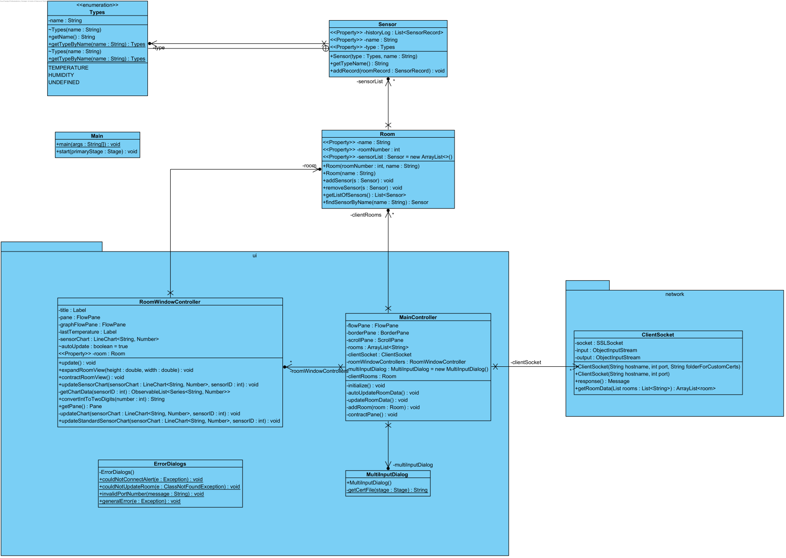

# IDATA2304 Temperature Logger

This is a school project in the course IDATA2304 Computer Networks by the students taking the computer engineering course 2022 on NTNU.
The project is part of our evaluation within the course, and has a 40% weight on the total grade.  

## Abstract

In modern society sleeping problems is a common problem. Sleep problems might
have many causes, but two of the most common causes is the room
temperature and humidity. To avoid this problem, we have made a temperature
logger that measures the temperature in a room and sends the data to a database.
The data is then visualized in an application. This way the user can see what
temperature makes for the best sleep quality, and if the humidity is on the
optimal level for good sleep and good health. Possible future work could be
adding the ability to see the average temperature and humidity at any given time of day,
and the ability to rate your sleep to get a better view of what makes the sleep quality
increase, and what makes it decrease.

### Alternative 2

Temperature and humidity is something that effects us every day. In some cases can it cause drastic changes to our life, like bad sleep or hypothermia.

## Introduction
In a world where more and more people struggle with sleep problems, it's
important to do research and make products that can help people
fix these problems to increase their quality of life. As a part of
the solution, we made our very own temperature sensor. It is designed to be placed in the
bedroom of a user, tracking the temperature and humidity of the room.
The Methodology-segment of the report contains the method we used to get to the result, how we
worked in groups, how distributed the, tasks, how we got passed obstacles
and how we evaluated the result.

In this report there will be a focus on the device and how it was created. The chapter theory and technology, will
define important terms used in the report and the specific technology in use in our product.

We have made an application that measures and records the temperature and humidity
in a room throughout the day via a temperature- and humidity-sensor.
There are many benefits to monitoring your indoor environmental conditions with an application such as this.
One of the most important reasons to use a sensor such as this,
is to make sure that you are maintaining a healthy indoor air quality in the various rooms in your house,
such as your living room, bedroom, and bathroom.
Because if you don’t, you may risk affecting your, and others’, health.

As previously stated, poor indoor air quality can bring some unfortunate consequences.
Mould in the house can cause sickness like a stuffy nose, sore throat,
coughing, burning eyes and rashes on your skin.
If you are allergic to mould, depending on the severity of the allergy,
can lead to very serious reactions, and hospital visits.
It has also been documented that the proper temperature and humidity has direct impact on the quality of your sleep.

If you have been having trouble getting a good night’s sleep,
it might be worth taking into consideration the temperature and humidity in your bedroom during the night.
Depending on where your bedroom windows are located, and the climate your country experiences,
you might be having some humidity and temperature swings during the night that can negatively influence your sleep.
Research shows that the ideal temperature for a bedroom is around 14-18 degrees Celsius.
The proper humidity in a bedroom fluctuates depending on the season,
but should be around 50% in the winter and a little higher in the summer, but not above 60%.
Using our temperature and humidity sensor could assist greatly in making sure your sleep conditions are optimal,
so that you wake up rested and can live a healthy and happy life.

# Above this needs to have references

These are just a few examples of the importance of our project
and what problems in our every-day lives it can help to solve.

## Theory and technology

Since we build our own server and the client were also written in java we decided to use the ObjectInput and ObjectOutput streams, so we could send objects back and forth. This was so that the implementation of both sides could be easier done, and since it was already created it saved us some work.

The message object that we are sending was highly inspired by the HTTP standard. There was 1 major benefits for doing it this way. It would allow for a good and fast implementation of allowing the HTTP protocols.

The project is highly reliant of the TCP protocol because we needed the reliability for the packages not becoming lost or corrupted. UDP was not a alternative since the data would heavily fluxuate based on the customers preferences as well as the amount of sensors. The only case  where UDP would be applicable is if you had enough sensors in a room to where inaccurate data would not be a problem anymore. We also wanted to implement the use of HTTP also within the project. This would allow for clients or code not running native java, like a arduino, to communicate with the server using JSON objects. Since both standards are well known, it would also be easier for other developers to create sensors by giving them some requirements of what they had to send.

The encryption method we decided on was the use of TLS. This was with the anticipation of allowing for web browsers to take contact with the server by using the HTTP protocol. We decided against letting the java client trust everything and instead add functionality to fetch different self-signed certificates from a folder or a file. This allows us to take the full functionality of TLS to verify that the source is trustworthy, while also encrypting the content and ensuring that it is not tampered with.

The only other subject we ended up implementing was IDATA2303, Data modeling and database application. This was to store the sensors, rooms and the log data. We implement the use of the database by using "connectors" to read and write data on the database file whenever the server gets a request.

## Methodology

We focused on working individually by splitting up the different parts of the projects. We had mostly two people working on the client side and one working on the server side. Meeting up often has allowed us to have open discussions, ask questions among the group members, keep ourselves up to date on what the other group members are doing, give either insight or advice, as well as ask about implementation of each others' code.

As a group, we did not have a set way of doing things. This is because of different visions, insight and experiences between the different group members. While some created branches to label their code task others pushed straight to main with belief that the commit messages was a good enough description. This has both caused negative effects, like unfinished code being pushed to main causing errors to show up in others' code, but also some positive effects like getting out code faster, and in some cases it has actually made the process more reliable due to the coder being cautious that the code actually works before pushing.

We have next-to-no user-tests simply because we finished the program very close to the final deadline. We conducted some test using JUnit on some classes where we found it necessary, to ensure that the code still worked after modification. This could have been done more often as there were several occations where we had to modify finished code because it reported incorrectly, or failed after testing when communicating with clients or sensor nodes over the internet.

## Results

We had big ambitions, but we only managed to create a minimally viable product. The product allows for temperature/humidity sensors to send data as long as it is registered in the database, as well as allows for the clients to view the data of the different rooms and their sensors. The program also allows for the traffic to be sent with TLS to validate and encrypt the packages.

### Server

The current working Java server uses the following implementation:

When the server receives a request trough the JavaListener it creates a new JavaClient and adds it to the ClientHandler. The JavaListener is a extension of the TCPListener that will add the client to the ClientHandler. The reason we use different specific classes for communication is to allow for faster and cleaner implementation of other protocols. Theoretically, everything that needs to be done to implement another service is to just create another listener based on the TCPListener and another Client class from ClientRunnable.

Every time the ClientRunnable finds a response, it uses the RequestHandler to process and create the proper response message. The requestHandler's job is to process the message object received from the getRequest method in the ClientRunnable. It starts by filtering the message object into the different kinds of available message types and further calls methods responsible for those kinds. It will in the end call the SQLCommandFactory that will create the right SQL statement and convert it to a java object trough the SQLConverter. If any of the methods that the requestsHandler is calling throws a error it will be logged within the respected class and the requestsHandler will use the error to create a errorMessage that the ClientRunnable will need to send.

The reason for creating the clientHandler and DBConnector pool is to allow for small optimization. The DBConnector is to already have a bunch of connectors available instead of designating one DBConnector per client. This removes the opening and closing connection on the databases whenever a client connects or disconnects. This also creates a better environment for the connector since a model where every client has it's own will work, but the connector may not be in use and only use space within the ram. The same within the clientHandler. Instead of designating a thread per client, that would be faster, it's not necessary. Since the probability of every client sending requests at the same time is very low, we could instead just check it one per time we go trough the list. This reduces the amount of thread necessarily from x clients to (1+pool size) times (1 + Clients/LimitOnClientHandler) rounded down. This makes the the amount of threads the server needs scale much better.

There is still a bunch of features the server can do, but needs to implement like adding new nodes and rooms. While it is missing these features the skeleton of the server application is finished.

### Clients

The current working Java client uses the following implementation:

The application for clients is a JavaFX application. The application is split into three parts. The first part is the connection screen. The connection screen is used to connect to the server. The second part the send and recive screen. The send and recive screen is used to send and recive data and certificate from and to the server. The third is the main screen. The main screen is used to view the different rooms and sensors.

The ClientSocket class is used for communication with the server.

### Sensors

The sensors is a modified version of the one given by us from <https://github.com/ntnu-datakomm/project-resources/tree/main/sensor-node-example>. This was done because we originally wanted to use microcontrollers but prioritized other stuff like optimizing the server. The things we modified was linking it to the already created sensor version we had in the data folder and adding a nodeSocket, quite similar to the clientSocket.

We wanted to restrict what sensor nodes that could send information. Therefor we have listed the different nodes within the database with api-keys and the type of sensor it is. That way the sensor need only to send it's key to be identified within the system and the database could be able to distinguish when fetching the data to know what kind it is. This allows us to track what each sensor is sending but also restricts so that we must have the sensor within the database to allow it.

## Discussion

Here you can reflect on the result. What is working well? What is not working
well and why?

The ui could be improved by adding a way to add new rooms and sensors. This would be done by adding a new screen that would allow for the user to add a new room or sensor. This would be done by sending a request to the server with the information about the new room or sensor. The server would then add the new room or sensor to the database and send a response to the client. The client would then update the ui with the new room or sensor.

## Conclusion and future work

While the project did not have all the functionality we wanted it was still an interesting and cool project to work on. We were able to create a minimal required product from scratch, and code that we could hopefully use in further projects that uses network.

While we have created the minimal required product we still feel like the project has more potential. For example one, we originally wanted to use HTTP to communicate with the sensors to allow small microcontrollers, like arduino that run different languages, to allow for communication with the server.

Here you summarize the work shortly, the status. Also, here you identify the
potential work in the future. Note: think in general - how could this work be
continued (by your group or by others)?

## References

[Site: National Library of medicine, Article: Planting Healthier Indoor, Author: Luz Claudio, October 2011](https://www.ncbi.nlm.nih.gov/pmc/articles/PMC3230460/)

[Site: The Sleep Charity, Article: Sleep Environment, December 2022](https://thesleepcharity.org.uk/information-support/adults/sleep-environment/)

Here you provide sources of information. In a written report you typically
include list of references in the end and have only links to those in the text,
such as [1], [2], [3]. In markdown (as this document will be) you can include
most of the links directly in the text. Here in this section you should list the
sources of information you have used - books, articles, Wikipedia articles,
other online articles. For each of them you should specify at least the title,
the author. If available: web link and year when this was published.

Note: YouTube videos are not a good source for information... Some of them are
very good, but in general YouTube is a large trash bin, where some things turn
out to be "edible".
